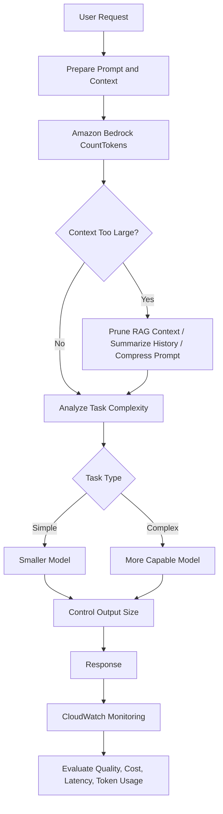

# Diagram – Token Optimization and Smart Model Routing

```mermaid
flowchart TD
    A[User Request] --> B[Prepare Prompt and Context]
    B --> C[Amazon Bedrock CountTokens]
    C --> D{Context Too Large?}
    D -- Yes --> E[Prune RAG Context / Summarize History / Compress Prompt]
    D -- No --> F[Analyze Task Complexity]
    E --> F
    F --> G{Task Type}
    G -- Simple --> H[Smaller Model]
    G -- Complex --> I[More Capable Model]
    H --> J[Control Output Size]
    I --> J
    J --> K[Response]
    K --> L[CloudWatch Monitoring]
    L --> M[Evaluate Quality, Cost, Latency, Token Usage]
```
