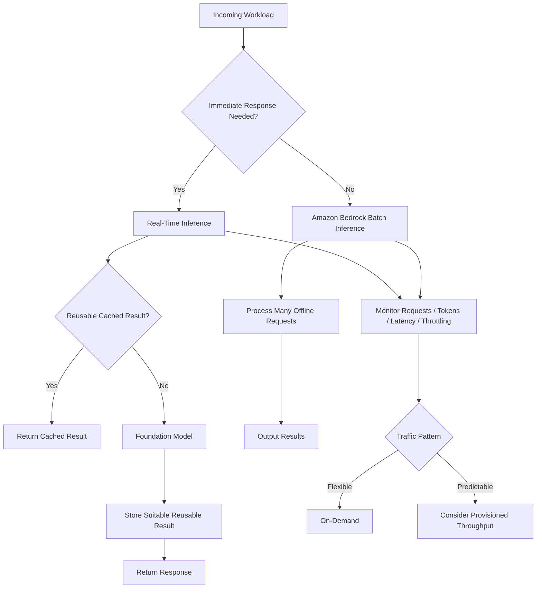

# Diagram – Resource Utilization, Batch Processing, and Caching

```mermaid
flowchart TD
    A[Incoming Workload] --> B{Immediate Response Needed?}
    B -- Yes --> C[Real-Time Inference]
    B -- No --> D[Amazon Bedrock Batch Inference]
    C --> E{Reusable Cached Result?}
    E -- Yes --> F[Return Cached Result]
    E -- No --> G[Foundation Model]
    G --> H[Store Suitable Reusable Result]
    H --> I[Return Response]
    D --> J[Process Many Offline Requests]
    J --> K[Output Results]
    C --> L[Monitor Requests / Tokens / Latency / Throttling]
    D --> L
    L --> M{Traffic Pattern}
    M -- Flexible --> N[On-Demand]
    M -- Predictable --> O[Consider Provisioned Throughput]
```
