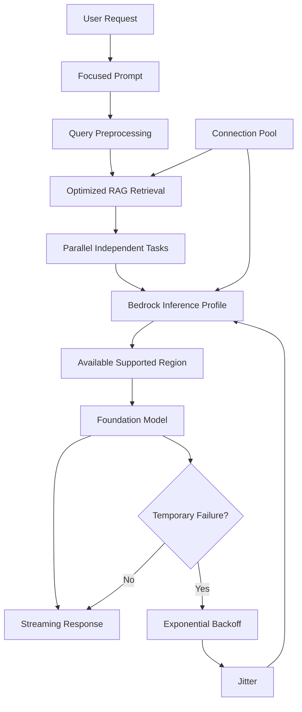

# Diagram – Responsive and Resilient GenAI Architecture

```mermaid
flowchart TD
    A[User Request] --> B[Focused Prompt]
    B --> C[Query Preprocessing]
    C --> D[Optimized RAG Retrieval]
    D --> E[Parallel Independent Tasks]
    E --> F[Bedrock Inference Profile]
    F --> G[Available Supported Region]
    G --> H[Foundation Model]
    H --> I[Streaming Response]
    H --> J{Temporary Failure?}
    J -- Yes --> K[Exponential Backoff]
    K --> L[Jitter]
    L --> F
    J -- No --> I
    M[Connection Pool] --> D
    M --> F
```
