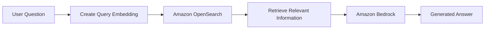
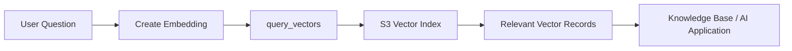
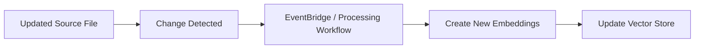
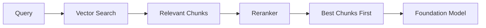
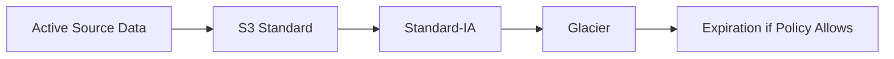
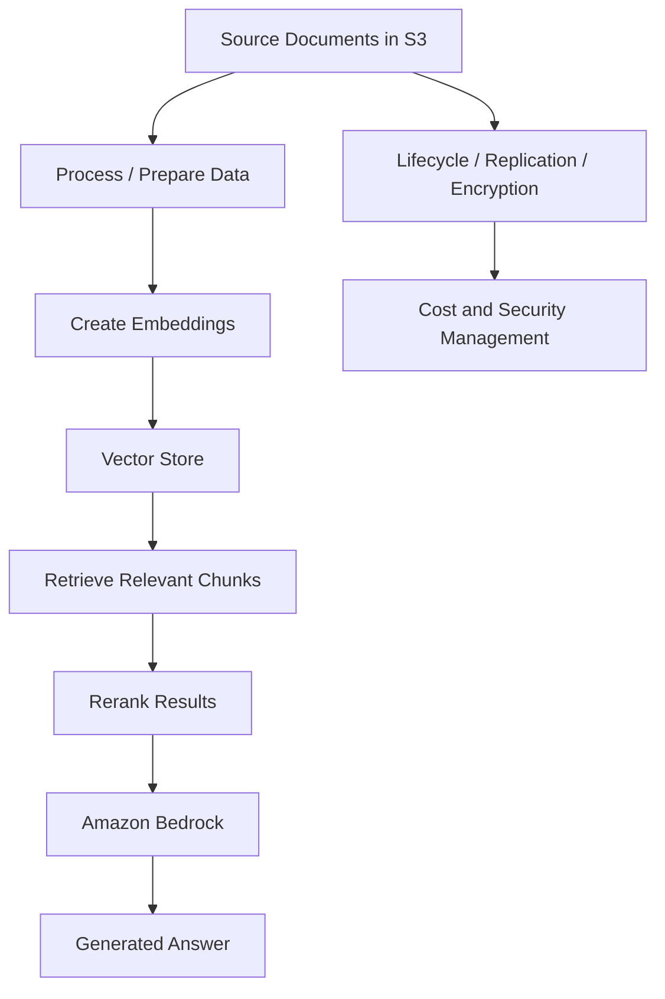

# GenAI Data Workflows

These are the main workflows I understood while preparing the Week 6 BLA. They are written as study diagrams so I can see how the AWS services connect together.

## 1. OpenSearch Retrieval Workflow

The Foundation Model generates the answer. OpenSearch helps decide which source information should be sent to the model as context.

## 2. S3 Vectors Retrieval Workflow

S3 Vectors provides another storage layer for embeddings. The vector search retrieves information, while the AI application uses that information afterward.

## 3. Updating a Vector Store

The purpose of this workflow is to reduce the chance that an AI application keeps retrieving an older version of business information.

## 4. Reranking Workflow

Reranking happens after retrieval. It improves the order of the retrieved chunks instead of replacing the vector store.

## 5. S3 Data Lifecycle for GenAI Source Files

This shows how older GenAI source data can move into lower-cost storage instead of staying forever in the most active class.

## 6. Complete GenAI Data Management View

This final view helped me understand that retrieval quality, storage cost, security, and data freshness are all part of the same GenAI data architecture.
