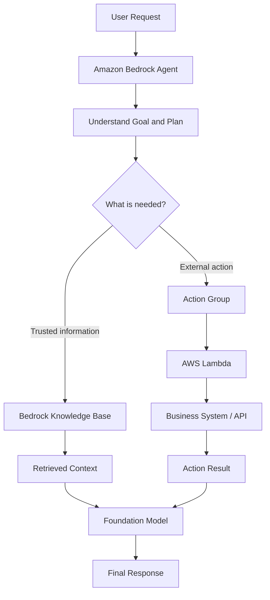

# Diagram 1 – Amazon Bedrock Agent Workflow

```mermaid
flowchart TD
    A[User Request] --> B[Amazon Bedrock Agent]
    B --> C[Understand Goal and Plan]
    C --> D{What is needed?}
    D -->|Trusted information| E[Bedrock Knowledge Base]
    D -->|External action| F[Action Group]
    F --> G[AWS Lambda]
    G --> H[Business System / API]
    E --> I[Retrieved Context]
    H --> J[Action Result]
    I --> K[Foundation Model]
    J --> K
    K --> L[Final Response]
```

This diagram shows how an agent can decide whether it needs trusted information or an external action before creating the final response.
